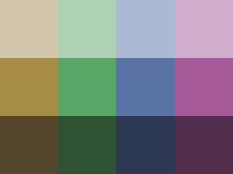
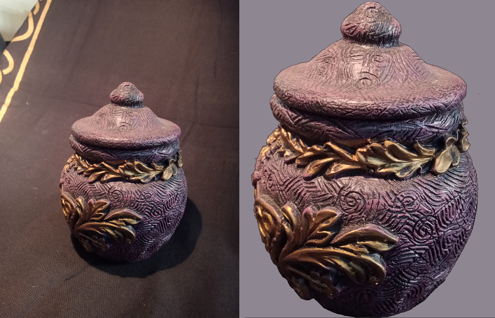
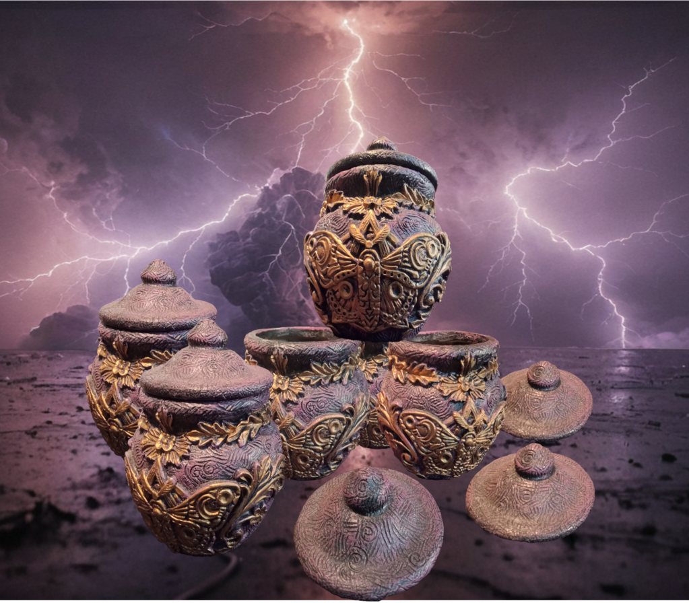

<h2 align="center">
:clipboard: Website Design :clipboard:
</h2>

> [!Tip]
> This page shows an overview of the project, as well as some notes about progress.

<!-- Main Overview -->
<h2 align="center"> Overview </h2>

<h4 align="center">
  
  [:question: Preview the website at any time by clicking here! :question:](https://fennifae.github.io/)
</h4>

*Construction of the website is well under way!*

This page houses the files for the website as it is under development. As changes are made, they will be periodically updated here, where they can be accessed and reviewed.

The general plan for the website is outlined below, in the Roadmap. Plans for features are arranged into a list of checkboxes, which will become filled as that milestone is achieved.

> [!Note]
> Since the last update, much has improved.   
The Website has outgrown the previously used Preview Engine, and has been replaced with genuine web hosting through Github Pages! Technically, it's not preview, but a real website actually on the internet. It just has a different address!  
Both the Navigation Bar and the Footer have been made into intelligent modules, powered by JavaScript. The Navigation bar features the ability to open and close automatically when the user hovers over it (on computers). The Footer features mandatory FDA disclosures and all important contact information.   
Device optimization has been thoroughly tested using device emulators, to ensure maximum compatability. The website will adapt to the resolution of the device used (including mobile screen flips and desktop window resizing).   
A <i>Tetradic</i> (4-Color) color scheme has been implemented. This scheme is known for being especially beautiful when the colors chosen follow a pattern.  <i>Heartbeat</i>, a custom utility for controlling the slideshows, is also fully functional. The slideshows may be paused or cycled through manually without de-synchronzing. A regular 'pulse' times the slideshows to switch every 5 seconds (alternating which slideshow is moved forward).  
The slideshow images have been heavily optimized, and are now only 7% thier original size, with good quality! This allows for more images, as well as saving bandwidth so that more visitors are allowed per month before needing to extend the plan (the current estimate for this free version is around 1000 per month).

> [!Important]
> Under the **About** section on the right of the screen, press **Activity** (Next to the Graph icon) to see progress and changes made. On mobile devices, this is along the top of the screen.

> [!Warning]
> Sometimes, such as just after an update or viewing multiple times in a row, the Preview for the website may encounter an error. This is temporary and usually fixed by refreshing or restarting.

*The color palette currently in use*

*The image cleaning process applied to a jar*

*An example of what can be done with cleaned images*

<!-- Roadmap -->

  
<h2>Roadmap</h2>

### *Roadmap* :white_check_mark:
- [x] *Complete the roadmap*

<table><tr><td>

### Age Restriction :white_check_mark:

- [x] A page which redirects to the homepage upon confirming age

> *This page sholud have an inviting layout, featuring a panel with two buttons. One should allow the user to confirm that they are over 21, while the other exits the page.*

 </td></tr></table>
<table><tr><td>

### Homepage :white_check_mark:
- [x] Welcome (Who we are)

> *The 'welcome' section is the first thing the user sees (after age verification). This should be inviting and colorful, drawing the user further into the site. Some simple text can accompany some general images of the store.*

- [x] General information (About us)

> *The 'general information' panel should showcase some pictures of the store, as well as stating a some simple information about it, such as how long the store has been open.*

-  ~~Product showcase (Featured products)~~

> ~~*The 'product showcase' panel should display a slideshow of high-quality images, captioned with simple information about the items. Clicking on one of these images would direct the user to the main page for those products.*~~

> [!Important]
> **__The 'Product Showcase' feature has not been implemented, as it seemed redundant given the rest of the website's design. This has been replaced by the store hours and an interactive map.__**

- [x] Footer (Contact info)

> *The 'footer' (at the bootm of the page) typically has the store's phone number, email, and address.*

 </td></tr></table>
<table><tr><td>

### The Lounge :white_check_mark:

- [x] Showcase the Lounge

> *This page should feature pictures of the lounge from many different angles, stating various features such as the TV, chalkboard, and games. Some information can be included here which references memberships.*

 </td></tr></table>
<table><tr><td>

### Crystals :o:

- [x] Arrange into general categories

> *Due to the revolving nature of inventory, stones can be described better by general type (Jewelery, Obelisk, Geode) than by direct description (3" Amethyst Palm). The 'categories' panel should feature pictures with collections of items belonging to that category. Clicking one of these images would bring the user to a page with some examples.*

- [ ] Showcase products individually (Images and descriptions)

> *Due to the revolving nature of inventory, stones are show as examples of the products available at the store. These sub-pages should feature as many images of the current inventory as possible. It should be clearly implied that these items may not always be in stock, and that the customer should 'discover'.*

> [!Important]
> **__The 'Product Showcase' feature will likely be replaced by two automatic slideshows with generalized descriptions. A central interactive panel will provide pictures and descriptions of products which are sure to stay in stock, such as quartz and amethyst. The current design features stones at the top of the page, leading into jewelry farther down. This page is currently under constructon.   This page could reasonably house a widget, such as a horoscope or positive quotes.__**

 </td></tr></table>
<table><tr><td>

### CBD Products :o:

- [ ] Arrange into general categories
- [ ] Showcase products individually (Images and descriptions)

> *This page will follow a similar design to the 'crystals' page. Legal disclaimers will be placed where necessary.*

 </td></tr></table>
<table><tr><td>

### Decor :o:

- [ ] Arrange into general categories
- [ ] Showcase products individually (Images and descriptions)

> *This page will also follow a similar design to the 'crystals' page. Categories include items such as tapestries, insence products, and artwork.*

> [!Important]
> **__The 'Product Showcase' feature will likely be replaced by two automatic slideshows with generalized descriptions. A central interactive panel will provide pictures and descriptions of products which are sure to stay in stock, such as incense and sage. The design for this page is currently using the slideshows from the 'Stones' page as placeholders. It will feature decorations such as tapestries at the top of the page, leading into incense and crystal holders farther down.  This page will likely be simpler than the 'Stones' page.__**

 </td></tr></table>

